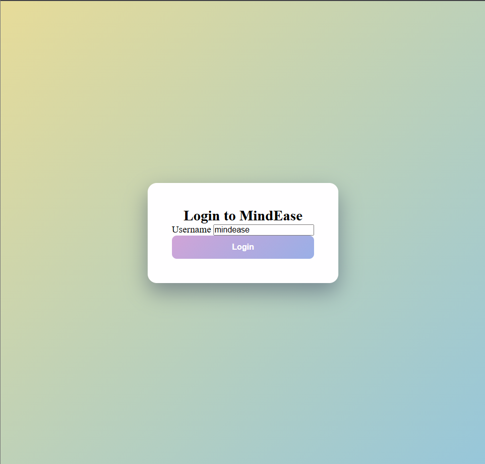
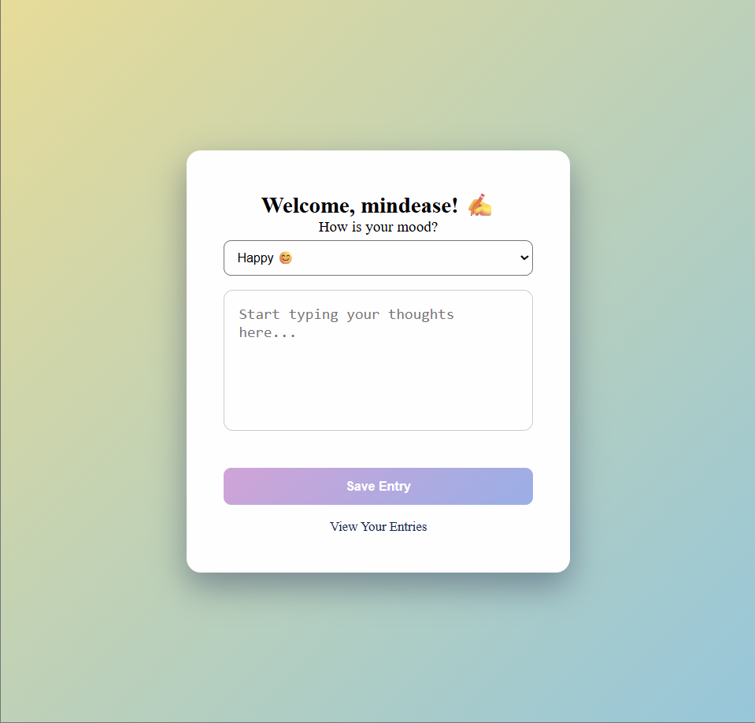
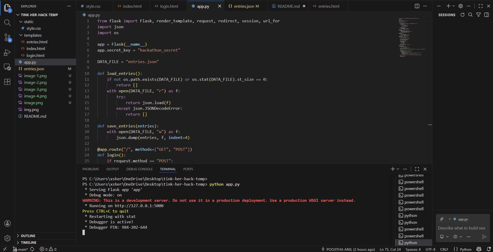

<p align="center">
  
</p>

# [MINDEASE] 🎯

## Basic Details

### Team Name: [NOODLES]

### Team Members
- Member 1: [POOJITHA ANIL] - [GOVERNMENT ENGINEERING COLLEGE THRISSUR]
- Member 2: [PRATHYUSHA S] - [GOVERNMENT ENGINEERING COLLEGE THRISSUR]

### Hosted Project Link
[mention your project hosted link here]

### Project Description
[MindEase is a Flask-powered journaling app that helps users monitor their mental health. Unlike a plain notebook, it detects your mood as you write and offers immediate motivational support based on how you’re feeling today.]

### The Problem statement
[Many students struggle to express emotions.Existing journaling apps feel overwhelming.We built a minimal,emotionally safe digital journal that makes reflection simple and accessible.]

### The Solution
[We solved the problem of emotional tracking by building a Flask-based web application that uses state-management to provide real-time motivational support. By combining a Mood-First data entry system with a Dockerized backend, we created a reliable, empathetic tool for daily mental health management.]

---

## Technical Details

### Technologies/Components Used

**For Software:**
- Languages used: [python,HTML5,CSS3,YAML,Markdown]
- Frameworks used: [Flask,Jinja2]
- Libraries used: [json,os,gunicorn]
- Tools used: [VS Code,Git&Github,Docker,ender.com]

---

## Features

List the key features of your project:
- Feature 1: [Secure user authentication.]
- Feature 2: [Mood-First Journaling Interface]
- Feature 3: [Dynamic Motivational Feedback]
- Feature 4: [Persistent entry history]

---

## Implementation

### For Software:

#### Installation
```bash
[pip install -r requirements.txt]
```

#### Run
```bash
[Run commands - python app.py]
```


---

## Project Documentation

### For Software:

#### Screenshots (Add at least 3)

]
This screenshot shows the secure entry point of the application, featuring a clean, responsive login interface with custom CSS gradients.

]
The core journaling interface where users select their current mood before documenting their thoughts, enabling structured emotional tracking.

]
The backend development environment in VS Code, showing the Flask server running successfully and the organized project directory structure.

#### Diagrams

**System Architecture:**

![[ User Browser ] 
              |
      (HTTP POST / GET)
              |
              ▼
    [ Docker Container ] <---- (Deployed on Render.com)
     _______________________
    |  [ Flask Backend ]    |
    |       (app.py)        |
    |__________|____________|
               |
      (Read/Write JSON)
               |
               ▼
      [ entries.json ] 
    (Data Persistence)](docs/architecture.png)
Client Layer: The user interacts with a responsive frontend built with HTML5 and CSS3, styled with a focus on mental wellness.

Server Layer: A Flask (Python) backend handles the logic, including user session management and mood-based conditional routing.

Data Layer: Journal entries and mood metadata are persisted in a JSON file system for lightweight, efficient data handling.

Infrastructure: The entire application is containerized using Docker and deployed via Render, ensuring a consistent environment from development to production

**Application Workflow:**


Authentication: The user logs in via the centered login card.

Mood Selection: Before journaling, the user selects their current emotional state (Happy, Neutral, or Sad).

Data Submission: The journal entry and mood are sent to the /add route via a POST request.

Persistence & Analysis: The backend appends the entry to entries.json and analyzes the last_mood value.

Motivational Feedback: The system redirects the user to the entries page, where a dynamic Jinja2 template displays a personalized motivational message based on the analyzed mood.

---


*List out all components shown*


*Explain the build steps*


*Explain the final build*

---

## Additional Documentation

### For Web Projects with Backend:

#### API Documentation

**Base URL:** `https://api.yourproject.com`

##### Endpoints

**GET /api/endpoint**
- **Description:** [What it does]
- **Parameters:**
  - `param1` (string): [Description]
  - `param2` (integer): [Description]
- **Response:**
```json
{
  "status": "success",
  "data": {}
}
```

**POST /api/endpoint**
- **Description:** [What it does]
- **Request Body:**
```json
{
  "field1": "value1",
  "field2": "value2"
}
```
- **Response:**
```json
{
  "status": "success",
  "message": "Operation completed"
}
```

[Add more endpoints as needed...]

---

### For Mobile Apps:

#### App Flow Diagram


1. Authentication Stage
User Action: The user arrives at the landing page and enters their username into the login card.

Backend Process: Flask captures the username and stores it in a session variable, allowing the app to "remember" the user as they move between pages.

2. Data Entry & Mood Selection
User Action: On the journal page, the user first selects their current emotion (Happy, Neutral, or Sad) from the dropdown and then writes their thoughts in the text area.

Layout Benefit: By placing the mood picker first, the app helps the user identify their emotional state before they begin the descriptive writing process.

3. Processing & Persistence
User Action: The user clicks the "Save Entry" button.

Backend Process: The form data is sent to the /add route, where the Python script appends the new entry (including the user's name, text, and mood) to the entries.json file.

4. Dynamic Feedback & History
User Action: The user is automatically redirected to the Entries History page.

Backend Process: The app runs a conditional check on the most recent mood saved.

Outcome: If the last mood was "Sad," the user sees a supportive message; if "Happy," they receive an encouraging celebration of their mood.

#### Installation Guide

**For Android (APK):**
1. Download the APK from [Release Link]
2. Enable "Install from Unknown Sources" in your device settings:
   - Go to Settings > Security
   - Enable "Unknown Sources"
3. Open the downloaded APK file
4. Follow the installation prompts
5. Open the app and enjoy!

**For iOS (IPA) - TestFlight:**
1. Download TestFlight from the App Store
2. Open this TestFlight link: [Your TestFlight Link]
3. Click "Install" or "Accept"
4. Wait for the app to install
5. Open the app from your home screen

**Building from Source:**
```bash
# For Android
flutter build apk
# or
./gradlew assembleDebug

# For iOS
flutter build ios
# or
xcodebuild -workspace App.xcworkspace -scheme App -configuration Debug
```

---


### For Scripts/CLI Tools:

#### Command Reference

**Basic Usage:**
```bash
python script.py [options] [arguments]
```

**Available Commands:**
- `command1 [args]` - Description of what command1 does
- `command2 [args]` - Description of what command2 does
- `command3 [args]` - Description of what command3 does

**Options:**
- `-h, --help` - Show help message and exit
- `-v, --verbose` - Enable verbose output
- `-o, --output FILE` - Specify output file path
- `-c, --config FILE` - Specify configuration file
- `--version` - Show version information

**Examples:**

```bash
# Example 1: Basic usage
python script.py input.txt

# Example 2: With verbose output
python script.py -v input.txt

# Example 3: Specify output file
python script.py -o output.txt input.txt

# Example 4: Using configuration
python script.py -c config.json --verbose input.txt
```

#### Demo Output

**Example 1: Basic Processing**

**Input:**
```
This is a sample input file
with multiple lines of text
for demonstration purposes
```

**Command:**
```bash
python script.py sample.txt
```

**Output:**
```
Processing: sample.txt
Lines processed: 3
Characters counted: 86
Status: Success
Output saved to: output.txt
```

**Example 2: Advanced Usage**

**Input:**
```json
{
  "name": "test",
  "value": 123
}
```

**Command:**
```bash
python script.py -v --format json data.json
```

**Output:**
```
[VERBOSE] Loading configuration...
[VERBOSE] Parsing JSON input...
[VERBOSE] Processing data...
{
  "status": "success",
  "processed": true,
  "result": {
    "name": "test",
    "value": 123,
    "timestamp": "2024-02-07T10:30:00"
  }
}
[VERBOSE] Operation completed in 0.23s
```

---

## Project Demo

### Video
[Add your demo video link here - YouTube, Google Drive, etc.]

*Explain what the video demonstrates - key features, user flow, technical highlights*

### Additional Demos
[Add any extra demo materials/links - Live site, APK download, online demo, etc.]

---

## AI Tools Used (Optional - For Transparency Bonus)

If you used AI tools during development, document them here for transparency:

**Tool Used:** [e.g., GitHub Copilot, v0.dev, Cursor, ChatGPT, Claude]

**Purpose:** [What you used it for]
- Example: "Generated boilerplate React components"
- Example: "Debugging assistance for async functions"
- Example: "Code review and optimization suggestions"

**Key Prompts Used:**
- "Create a REST API endpoint for user authentication"
- "Debug this async function that's causing race conditions"
- "Optimize this database query for better performance"

**Percentage of AI-generated code:** [Approximately X%]

**Human Contributions:**
- Architecture design and planning
- Custom business logic implementation
- Integration and testing
- UI/UX design decisions

*Note: Proper documentation of AI usage demonstrates transparency and earns bonus points in evaluation!*

---

## Team Contributions

- [Name 1]: [Specific contributions - e.g., Frontend development, API integration, etc.]
- [Name 2]: [Specific contributions - e.g., Backend development, Database design, etc.]
- [Name 3]: [Specific contributions - e.g., UI/UX design, Testing, Documentation, etc.]

---

## License

This project is licensed under the [] License - see the [LICENSE](LICENSE) file for details.

**Common License Options:**
- MIT License (Permissive, widely used)
- Apache 2.0 (Permissive with patent grant)
- GPL v3 (Copyleft, requires derivative works to be open source)

---

Made with ❤️ at TinkerHub
